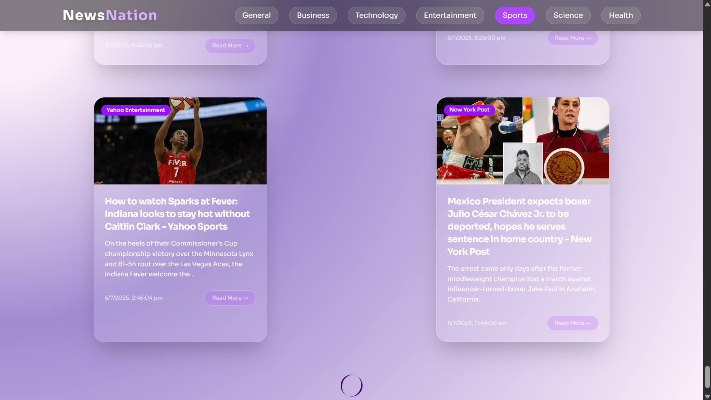

# 📰 NewsNation – Curated Daily Headlines at Your Fingertips

**NewsNation** is a fully responsive, modern news web application built with **React.js** that delivers real-time, category-based news updates using the [NewsAPI](https://newsapi.org). Designed with simplicity, clarity, and usability in mind, it provides users with a smooth reading experience across devices.

---

## 🚀 Features

- 🧠 **Category-Based Filtering** – Switch between categories like Business, Technology, Entertainment, Sports, and more.
- 🌀 **Infinite Scroll** – Seamlessly loads more articles as you scroll down.
- 🔄 **Live News API Integration** – Fetches the latest and most relevant headlines in real-time.
- 🧭 **Top Loading Progress Bar** – Shows the loading status with a sleek progress line for better UX.
- 📱 **Responsive Card Layout** – Displays each article in a clean, mobile-first card design.
- ⏰ **Timely News** – Updated hourly with current events and trending stories.
- 🌙 *Optional Future*: Dark/Light mode toggle for personalized reading experience.

---

## 🖼️ Preview



---

## 🛠️ Tech Stack

| Layer         | Tech                |
|---------------|---------------------|
| Frontend      | React.js            |
| Styling       | Tailwind CSS / CSS |
| API           | [NewsAPI.org](https://newsapi.org) |
| Routing       | React Router DOM    |
| Progress Bar  | [react-top-loading-bar](https://www.npmjs.com/package/react-top-loading-bar) |


---


---

## 📦 Setup & Run Locally

1. Clone the repository:
   
 ```bash
 git clone https://github.com/Niyati-Dinesh/newsnation
 cd newsnation
   ```

3. Install dependencies:

```bash
npm install
```
3. Create a .env file and add your News API key:
   
```bash
VITE_NEWS_API_KEY=your_newsapi_key_here
```

4. Start the dev server:

```bash
npm run dev
```

5. Open http://localhost:5173 in your browser.


